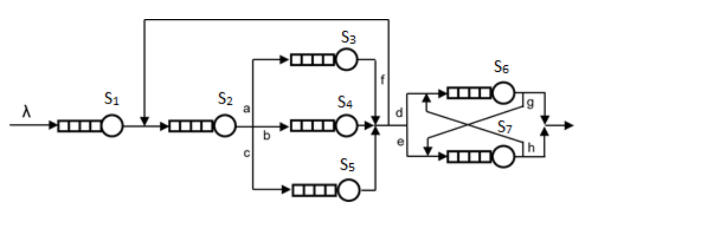

# Report

## Given values

### System configuration



### Packet transfet probabilities


| Branch | Probability |
|--------|-------------|
| a      | 0.2         |
| b      | 0.3         |
| c      | 0.5         |
| d      | 0.6         |
| e      | 0.4         |
| f      | 0.6         |
| g      | 0.2         |
| h      | 0.3         |

### Mean packet processing time

| Node          | Seconds per packet |
|---------------|--------------------|
| S<sub>1</sub> | 0.003              |
| S<sub>2</sub> | 0.001              |
| S<sub>3</sub> | 0.01               |
| S<sub>4</sub> | 0.04               |
| S<sub>5</sub> | 0.1                |
| S<sub>6</sub> | 0.13               |
| S<sub>7</sub> | 0.15               |

## Inferred values

The required answer is total time a packet is in the system.

```
T = f(λ)
```

### Definitions

| Symbol | Explanation |
|--------|-------------|
| N      | mean no. of requests to the system |
| T      | mean response time of the system |
| ρ      | mean utilization of the system |
| c      | capacity of the system |
| λ      | intensity of incoming requests |
| v      | number of passes through the system |

### Solutions

| Intensity (λ) | Value |
|:-------------:|-|
| λ<sub>2</sub> | λ + (λ<sub>2</sub> * f) = **λ / (1 - f)** |
| λ<sub>3</sub> | **λ<sub>2</sub> * a** |
| λ<sub>4</sub> | **λ<sub>2</sub> * b** |
| λ<sub>5</sub> | **λ<sub>2</sub> * c** |
| λ<sub>6</sub> | (λ<sub>2</sub> * d) + (λ<sub>7</sub> * h) = **λ * ((1 / (1 - f)) + ((h * (e + (d * g))) / ((1 - f) * (1 - (h * g)))))** |
| λ<sub>7</sub> | (λ<sub>2</sub> * e) + (λ<sub>6</sub> * g) = **λ * ((e + (d * g)) / ((1 - f) * (1 - (h * g))))** |

| Passes (v) | Explanation | Value |
|:-------------:|---|---|
| v<sub>1</sub> | 1 | 1 |
| v<sub>2</sub> | 1 / (1 - f) | 2.5 |
| v<sub>3</sub> | v<sub>2</sub> * a | 0.5 |
| v<sub>4</sub> | v<sub>2</sub> * b | 0.75 |
| v<sub>5</sub> | v<sub>2</sub> * c | 1.25 |
| v<sub>6</sub> | ((1 / (1 - f)) + ((h * (e + (d * g))) / ((1 - f) * (1 - (h * g))))) | 2.9148 |
| v<sub>7</sub> | (e + (d * g)) / ((1 - f) * (1 - (h * g))) | 1.3829 |

| Utilization (ρ) | Explanation (without `* λ`) | Value (without `* λ`) |
|:-------------:|---|---|
| ρ<sub>1</sub> | v<sub>1</sub> * S<sub>1</sub> | 0.003 |
| ρ<sub>2</sub> | v<sub>2</sub> * S<sub>2</sub> | 0.0025 |
| ρ<sub>3</sub> | v<sub>3</sub> * S<sub>3</sub> | 0.005 |
| ρ<sub>4</sub> | v<sub>4</sub> * S<sub>4</sub> | 0.03 |
| ρ<sub>5</sub> | v<sub>5</sub> * S<sub>5</sub> | 0.125 |
| ρ<sub>6</sub> | v<sub>6</sub> * S<sub>6</sub> | 0.3789 |
| ρ<sub>7</sub> | v<sub>7</sub> * S<sub>7</sub> | 0.207435 |

```text
T = ∑( ρn / (1 - λ * ρn) ) from n = 1 to n =7
```

### PDQ results

```text
L        | S1       | S2       | S3       | S4       | S5       | S6       | S7       | T
0.100000 | 0.003001 | 0.002501 | 0.005003 | 0.030090 | 0.126582 | 0.393848 | 0.211829 | 0.772853
0.200000 | 0.003002 | 0.002501 | 0.005005 | 0.030181 | 0.128205 | 0.409995 | 0.216413 | 0.795303
0.300000 | 0.003003 | 0.002502 | 0.005008 | 0.030272 | 0.129870 | 0.427524 | 0.221200 | 0.819379
0.400000 | 0.003004 | 0.002503 | 0.005010 | 0.030364 | 0.131579 | 0.446618 | 0.226204 | 0.845281
0.500000 | 0.003005 | 0.002503 | 0.005013 | 0.030457 | 0.133333 | 0.467497 | 0.231439 | 0.873247
0.600000 | 0.003005 | 0.002504 | 0.005015 | 0.030550 | 0.135135 | 0.490424 | 0.236923 | 0.903556
0.700000 | 0.003006 | 0.002504 | 0.005018 | 0.030644 | 0.136986 | 0.515716 | 0.242672 | 0.936546
0.800000 | 0.003007 | 0.002505 | 0.005020 | 0.030738 | 0.138889 | 0.543759 | 0.248708 | 0.972625
0.900000 | 0.003008 | 0.002506 | 0.005023 | 0.030832 | 0.140845 | 0.575026 | 0.255051 | 1.012291
1.000000 | 0.003009 | 0.002506 | 0.005025 | 0.030928 | 0.142857 | 0.610109 | 0.261726 | 1.056161
1.100000 | 0.003010 | 0.002507 | 0.005028 | 0.031024 | 0.144928 | 0.649751 | 0.268760 | 1.105007
1.200000 | 0.003011 | 0.002508 | 0.005030 | 0.031120 | 0.147059 | 0.694902 | 0.276183 | 1.159813
1.300000 | 0.003012 | 0.002508 | 0.005033 | 0.031217 | 0.149254 | 0.746797 | 0.284027 | 1.221849
1.400000 | 0.003013 | 0.002509 | 0.005035 | 0.031315 | 0.151515 | 0.807069 | 0.292330 | 1.292786
1.500000 | 0.003014 | 0.002509 | 0.005038 | 0.031414 | 0.153846 | 0.877924 | 0.301133 | 1.374877
1.600000 | 0.003014 | 0.002510 | 0.005040 | 0.031513 | 0.156250 | 0.962416 | 0.310483 | 1.471227
1.700000 | 0.003015 | 0.002511 | 0.005043 | 0.031612 | 0.158730 | 1.064904 | 0.320432 | 1.586248
1.800000 | 0.003016 | 0.002511 | 0.005045 | 0.031712 | 0.161290 | 1.191822 | 0.331040 | 1.726438
1.900000 | 0.003017 | 0.002512 | 0.005048 | 0.031813 | 0.163934 | 1.353086 | 0.342373 | 1.901784
2.000000 | 0.003018 | 0.002513 | 0.005051 | 0.031915 | 0.166667 | 1.564819 | 0.354511 | 2.128493
2.100000 | 0.003019 | 0.002513 | 0.005053 | 0.032017 | 0.169492 | 1.855110 | 0.367541 | 2.434745
2.200000 | 0.003020 | 0.002514 | 0.005056 | 0.032120 | 0.172414 | 2.277637 | 0.381565 | 2.874325
2.300000 | 0.003021 | 0.002514 | 0.005058 | 0.032223 | 0.175439 | 2.949403 | 0.396701 | 3.564360
2.400000 | 0.003022 | 0.002515 | 0.005061 | 0.032328 | 0.178571 | 4.183194 | 0.413089 | 4.817780
2.500000 | 0.003023 | 0.002516 | 0.005063 | 0.032432 | 0.181818 | 7.191561 | 0.430888 | 7.847302
2.600000 | 0.003024 | 0.002516 | 0.005066 | 0.032538 | 0.185185 | 25.606907| 0.450291 | 26.285526
```

### Comparison of analytical and PDQ results

| PDQ | Analytical |
|-|-|
| 0.772853  | 0.772879  |
| 0.795303  | 0.795330  |
| 0.819379  | 0.819408  |
| 0.845281  | 0.845312  |
| 0.873247  | 0.873280  |
| 0.903556  | 0.903592  |
| 0.936546  | 0.936585  |
| 0.972625  | 0.972667  |
| 1.012291  | 1.012337  |
| 1.056161  | 1.056211  |
| 1.105007  | 1.105063  |
| 1.159813  | 1.159875  |
| 1.221849  | 1.221918  |
| 1.292786  | 1.292865  |
| 1.374877  | 1.374967  |
| 1.471227  | 1.471332  |
| 1.586248  | 1.586372  |
| 1.726438  | 1.726588  |
| 1.901784  | 1.901971  |
| 2.128493  | 2.128735  |
| 2.434745  | 2.435073  |
| 2.874325  | 2.874804  |
| 3.564360  | 3.565141  |
| 4.817780  | 4.819313  |
| 7.847302  | 7.851751  |
| 26.285526 | 26.341500 |

The results are basically the same. There is a small discrepancy in the decimal
place number, but it's probably caused by rounding and precission errors in the
calculation process (PDQ uses floats, the analytical method was calculated
using double precision floats).
